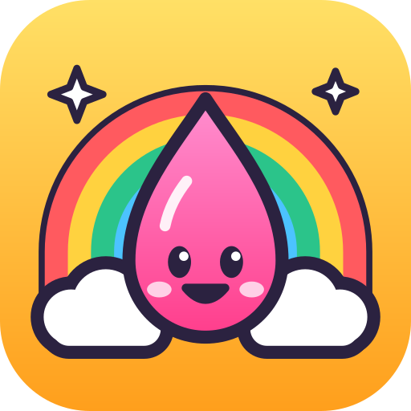
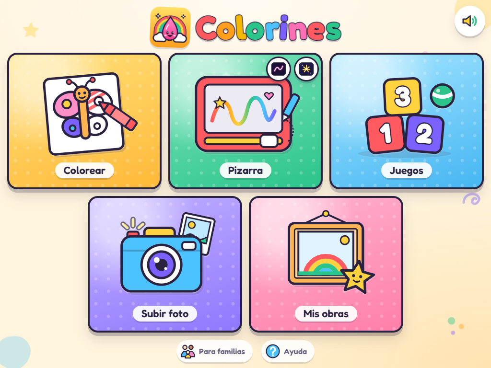
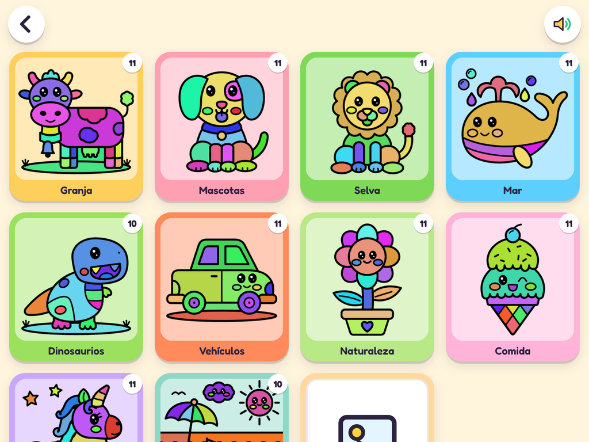
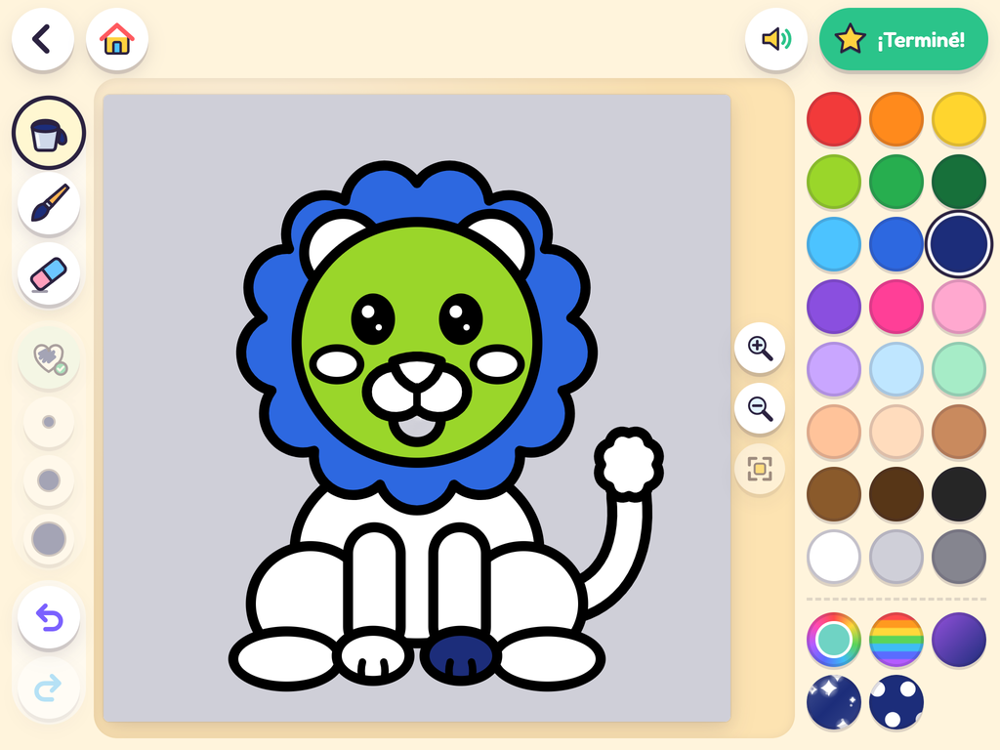
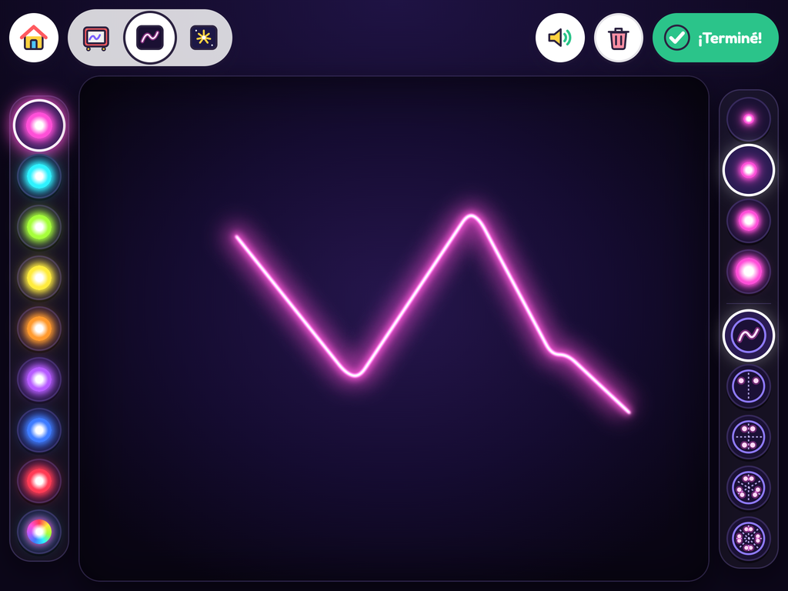
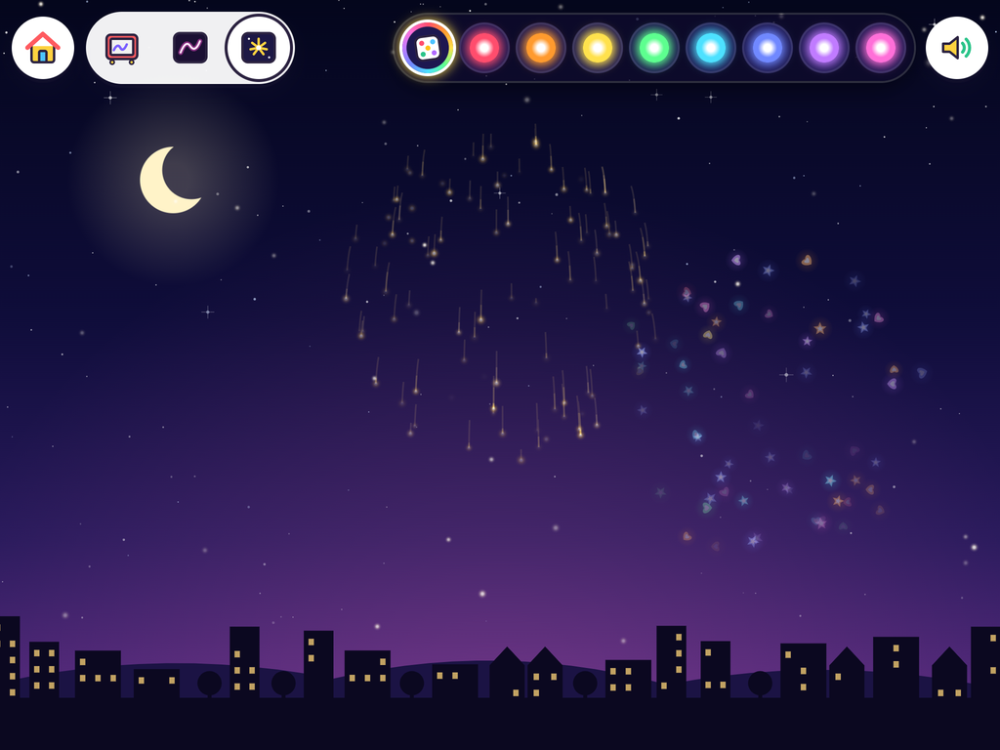

  
  <h1>🎨 Colorines 🖍️</h1>
  <h3>Una app para colorear y dibujar para chicos de 3 a 8 años</h3>

  
  
  
  
  
  
  

  

## 📄 Descripción

**Colorines** es una app web para que los más chicos coloreen, dibujen y jueguen aprendiendo colores y números
desde una tablet, un celular o la compu. Está toda en español, se puede instalar como app (PWA) y, una vez abierta, **anda sin
internet**.

Es 100 % estática: HTML, CSS y JavaScript puro, **sin backend ni dependencias**. Todo lo que hacen los chicos se
guarda en el propio navegador (IndexedDB), así que no hay cuentas, ni publicidad, ni datos que salgan del
dispositivo.

- **Edad:** 3 a 8 años
- **Dispositivos:** tablet, celular y compu (táctil, mouse y multitouch)
- **Idioma:** español
- **Sin internet:** sí, después de la primera vez
- **Seguridad para chicos:** para borrar cualquier cosa hay que mantener apretado el botón

## ✨ Qué se puede hacer

🖍️ Colorear

  
  

- **108 dibujos propios** en SVG, en 10 categorías (granja, mascotas, selva, mar, dinosaurios, vehículos,
  naturaleza, comida, fantasía y paisajes) + **Mis dibujos** con las imágenes subidas.
- Balde de pintura, pincel que **no se sale de las líneas**, goma, deshacer, rehacer y **borrar todo** para
  empezar de nuevo (manteniendo apretado).
- Zoom con pellizco, rueda del mouse o botones.
- 27 colores, selector de cualquier color y **rellenos especiales**: arcoíris, degradé, brillitos, lunares,
  estrellas, corazones, rompecabezas, ondas y escamas.
- **Segundo color** para los rellenos: manteniendo apretado un color (o con clic derecho) se elige el color de
  los lunares, las estrellas, la otra punta del degradé, etc.
- Autoguardado y botón **¡Terminé!** para guardar la obra.

📷 Subir foto

- Desde un archivo o directo con la cámara.
- Se limpia a blanco y negro con umbral ajustable y vista previa, en modo **página de colorear** o **foto**.
- Se achica automáticamente y queda guardada en *Mis dibujos*.

🖊️ Pizarra mágica

- Lápiz, fibra, pincel, crayón, aerosol, marcador arcoíris, brillitos, sellos y goma.
- 4 grosores y fondos blancos, de colores o de pizarrón.
- **Borrar todo** con una barrita que se desliza.

🌈 Neón

  

- Trazos que brillan, colores neón y arcoíris.
- Modo **espejo / caleidoscopio** de 2, 4, 6 u 8 ejes.

🎆 Fuegos artificiales

  

- Cada trazo es una **mecha** que se consume y explota.
- 9 tipos de explosión y multitouch para lanzar varios a la vez.

🖼️ Mis obras

- Galería con miniaturas grandes de todo lo que se terminó (y lo que quedó sin terminar).
- Seguir pintando, descargar como PNG, **imprimir** (PDF A4 con el logo, el nombre y www.colorines.com.ar) o
  borrar (manteniendo apretado).
- Al descargar o imprimir un dibujo para colorear se elige **con imágenes** si va pintado o sin pintar (para
  pintarlo a mano con crayones).

🎲 Juegos

- **Colores:** doce gotitas de colores con el nombre abajo en mayúsculas; al tocar una, se escucha su nombre.
- **Números:** del 0 al 10, cada número con esa cantidad de cosas (1 vaca, 2 caramelos, 3 pelotas...); al
  tocarlo se escucha el número y las cosas saltan de a una para contarlas.
- La voz es la del navegador: usa *Microsoft Sabina - Spanish (Mexico)* si está y, si no, la voz del sistema
  (una en español). El botón de sonido también la apaga.

👪 Para familias y ayuda

- Abajo en el inicio, **Para familias** explica qué es Colorines, qué aprenden los chicos y cómo colaborar
  (por ahora, compartiendo el enlace).
- **Ayuda** muestra qué hace cada botón de cada sección.

## 📜 Créditos

- Dibujos, ícono e interfaz: propios del proyecto.
- Fuente [Fredoka](https://fonts.google.com/specimen/Fredoka), bajo SIL Open Font License
  ([`app/fonts/OFL.txt`](app/fonts/OFL.txt)).

## ⚖️ Licencia

Distribuido bajo la [licencia MIT](LICENSE). Podés usarlo, modificarlo y compartirlo libremente, siempre que
mantengas el aviso de copyright y des crédito al autor original:

> Colorines — creado por **Maximiliano Simonazzi** ([github.com/maxisimonazzi](https://github.com/maxisimonazzi))
